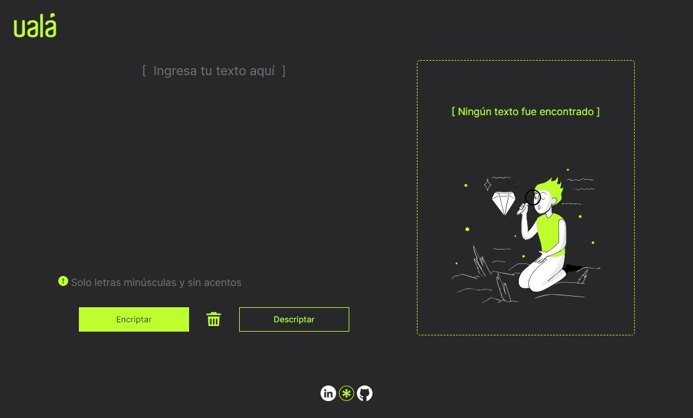

# ualá

🔒 Esta es una aplicación para codificar y decodificar mensajes de texto de forma sencilla 

🔓 Demo: https://leovfir.github.io/uala-encriptador/

🔐 Requisitos:
- Funciona solo con letras minúsculas, sin acentos ni caracteres especiales.
- Debe ser posible convertir una palabra a su versión encriptada y viceversa.
- La página debe tener campos de texto para ingresar el texto a encriptar o desencriptar.
- El usuario debe poder seleccionar entre encriptar y desencriptar.
- El resultado debe mostrarse en la pantalla.

🔑 Llaves de encriptación:
- "e" se convierte en "enter"
- "i" se convierte en "imes"
- "a" se convierte en "ai"
- "o" se convierte en "ober"
- "u" se convierte en "ufat"

✨ Bonus:
- Botón para limpiar/reiniciar los campos de textos.
- Botón para copiar el texto encriptado/desencriptado al portapapeles.

[Repositorio](https://github.com/leovfir/uala-encriptador)